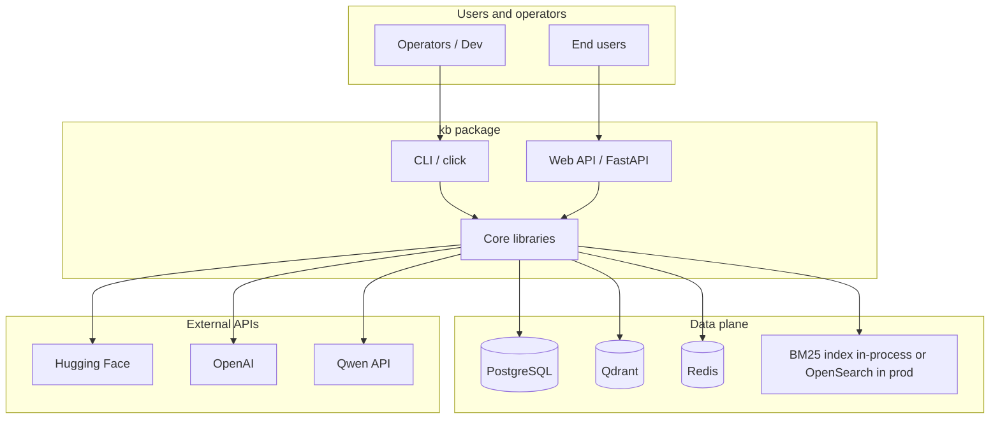
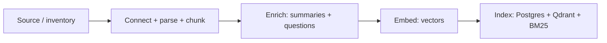
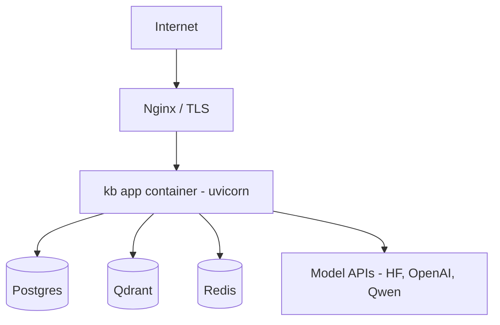

# Architecture

This document describes the **system architecture** of the *Knowledge Base Search* project: a Python application for **enterprise document ingestion**, **hybrid semantic + lexical retrieval**, and **grounded question answering (RAG)** with optional **session memory**, **faithfulness checks**, and a **web UI** plus **CLI**.

For provisioning costs, model inventory, and environment-specific setup, see `data/infra_provisioning.md`. For local run instructions, see `README.md`.

---

## 1. Goals and scope

| Goal | How it is achieved |
|------|-------------------|
| **Find relevant chunks** for a natural-language query | Hybrid pipeline: dense (vectors) + sparse (BM25), optional query rewrite, RRF fusion, cross-encoder rerank, parent expansion |
| **Ground answers in sources** | Context assembly with numbered chunks; answer text must cite chunk indices; citations resolved back to stored metadata |
| **Respect data sensitivity** | Sensitivity lanes, ACL on collections, generator **lane unification** (no mixing hosted and self-hosted models in one answer) |
| **Operate in multiple environments** | Pydantic `Settings` with deployment **profiles** (`demo`, `demo-isolated`, `prod`) and provider-specific env vars |
| **Ship as a product** | `click` CLI, `FastAPI` + static SPA under `kb/web/`, eval harness, Docker packaging |

**Non-goals in this repository:** end-user identity federation (SSO), multi-tenant billing, or production-grade secrets management—these are left to platform integration.

---

## 2. System context

External actors and systems:

- **Operators / developers** — run ingestion, health checks, evaluation, and the API server.
- **End users** (demo) — use the web UI or API; modeled via a **staff directory** and per-request user context for ACL.
- **Data plane (self-hosted or managed)** — **PostgreSQL** (content + metadata), **Qdrant** (vector index), **Redis** (sessions; optional for pure search).
- **Model providers (hosted APIs)** — **Hugging Face** (embeddings, rerank, NLI, optional LLM endpoints), **OpenAI**, **Qwen (DashScope-compatible)**, and optionally **TEI** (local embeddings in Docker).

---

## 3. High-level code layout

The installable package is `kb/`. Major boundaries:

| Area | Path | Responsibility |
|------|------|----------------|
| **Settings** | `kb/settings.py` | Central env-based configuration; profile rails |
| **Ingestion** | `kb/orchestration/pipeline.py`, `kb/chunking/`, `kb/parsers/`, `kb/connectors/`, `kb/enrichment/`, `kb/indexing/` | From files → chunks → (optional) enrichment → embeddings → **Postgres + Qdrant + BM25** |
| **Retrieval** | `kb/retrieval/` | `Retriever`: rewrite → embed → parallel dense/sparse → RRF → ACL → rerank → `RetrievalResult` |
| **Generation** | `kb/generation/` | `Generator`: retrieve → lane policy → refusal → context → LLM → citations; optional NLI faithfulness; streaming events |
| **Embeddings** | `kb/embeddings/client.py` | Batched calls to HF serverless or dedicated endpoint |
| **Sessions** | `kb/sessions/` | Redis-backed conversation turns + `SessionManager` (used when `session_id` is set) |
| **Web** | `kb/web/` | FastAPI app, JSON API, static `kb/web/static/` |
| **CLI** | `kb/cli.py` | `kb ingest`, `kb search`, `kb ask`, `kb health`, `kb eval`, sessions commands |
| **Eval** | `kb/eval/` | Golden-set runs, RAGAS batching, calibration hooks |

**Dependency direction (allowed):** web/CLI → generation/retrieval → settings, indexing clients, external SDKs. Lower layers do not import FastAPI or Click.

---

## 4. Ingestion pipeline

Ingestion is **staged**. Each stage strictly follows the previous (`kb/orchestration/pipeline.py`).

| Stage | What happens |
|-------|----------------|
| **chunk** | Connector reads documents; parser produces structure; **parent/child** chunking |
| **enrich** | Hypothetical questions, summaries (LLM-backed enrichment where configured) |
| **embed** | `EmbeddingClient` batch-embeds content and enrichment fields |
| **index** | `MultiIndexWriter` writes **idempotently** to all three stores |

**Indexing order and failure semantics** (`kb/indexing/multi_writer.py`):

1. **Record decision** (skip if unchanged content hash)
2. **Postgres** — authoritative text store; transactional
3. **Qdrant** — vectors; roll back Postgres if needed on failure
4. **BM25** — in-process (default) or OpenSearch in production profile
5. **Record marked indexed** only after all succeed

This ordering minimizes inconsistent states (e.g. vector without text).

---

## 5. Retrieval architecture

`kb/retrieval/retriever.py` — **`Retriever.retrieve(query, user, config)`** — is the main search orchestrator.

### 5.1 Stages (conceptual)

1. **Query rewrite** (optional) — HyDE / multi-query via `QueryRewriter`; degrades to raw query on failure
2. **Embedding** — one or more query variants
3. **Parallel retrieval** — **dense** (Qdrant) and **sparse** (BM25 / lexical index)
4. **Fusion** — Reciprocal Rank Fusion (RRF) over variant lists
5. **ACL** — filter by user-accessible Qdrant collections; additional sweep in Python; reranker only sees post-ACL candidates
6. **Cross-encoder rerank** (optional) — reorder fused candidates; fallback to RRF order on error
7. **Parent assembly** — dedupe, fetch parent/child text from Postgres as needed

### 5.2 Configuration

`RetrievalConfig` (`kb/retrieval/types.py`) controls top-K, rerank on/off, rewrite strategy, `multi_query_k`, **step-back** query expansion, etc. Defaults favor a balance between latency and quality; production can tighten thresholds.

### 5.3 Outputs

`RetrievalResult` contains scored `RetrievalHit` objects (with content snippets, source identifiers, and lane metadata) plus timing and resolved query information for UI/debugging.

---

## 6. Generation and RAG

`kb/generation/generator.py` — **`Generator`** — is the RAG orchestrator. Two entry points share the same logic:

- **`ask()`** — returns a full `GenerationResult` (synchronous)
- **`ask_stream()`** — yields `StreamEvent` tokens and a final `done` payload for SSE

### 6.1 Pipeline

1. **Retrieve** — same `Retriever` as search; `RetrievalConfig` aligned with request
2. **Lane decision** — most restrictive lane among hits; if any hit is `self_hosted_only`, the **entire** answer uses the self-hosted LLM path (no cross-lane mixing)
3. **Refusal gates** — empty retrieval or below-threshold scores can short-circuit without LLM
4. **Context assembly** — `ContextBuilder` / `ContextAssembler` builds a **token-budgeted** block of numbered sources
5. **Prompting** — system + user prompt via `PromptBuilder`
6. **LLM** — `LLMClient` routes to configured provider order per lane (`kb/enrichment/llm_client.py`)
7. **Citations** — parse `[N]` markers; map to retrieval hits; compute confidence
8. **Optional faithfulness** — `FaithfulnessChecker` (NLI) can verify cited sentences against sources when enabled

### 6.2 Sessions

When `session_id` is present, `SessionManager` (`kb/sessions/`) loads prior turns from **Redis**, applies a **conversation-aware rewriter** (so follow-up questions resolve with context), and stores new turns with TTL and max-turn limits (`kb/settings.py`).

---

## 7. Data stores and indexes

| Store | Role in this system |
|-------|---------------------|
| **PostgreSQL** | Canonical **parent/child** text, metadata, hashes for idempotent indexing, ACL-related fields as modeled |
| **Qdrant** | **Dense** vectors; filtered by **collection** / tenant semantics for ACL **pushdown** |
| **BM25** (in-process) | **Sparse** retrieval; `rank-bm25` in default setup |
| **Redis** | **Session** transcripts and rolling TTL; not required for one-shot search |

Health checks used by the API (`kb/web/app.py` and CLI) report status of the core data plane components the deployment expects (Postgres, Qdrant, BM25).

---

## 8. Security, sensitivity, and compliance posture

- **ACL** — `kb/retrieval/acl.py` enforces which collections a user can query; retriever applies filters before and after fusion.
- **Sensitivity lanes** — documents and hits carry lane metadata; **generator** enforces a **single LLM lane** per answer to avoid paraphrase leakage across boundaries.
- **Settings rails** — `APP_PROFILE=prod` refuses to start with unsafe demo override flags (`kb/settings.py`).
- **Web tier** — intended as a **demo**; production should add **authn/authz**, TLS termination, and rate limits (often at **Nginx** or API gateway).

---

## 9. External interfaces

### 9.1 Web API (`kb/web/app.py`)

- Static SPA at `/` (when `kb/web/static/` is present) and assets under `/static/`
- **JSON**: `/api/health`, `/api/config`, `/api/session/new`, `POST /api/search`, `POST /api/ask`, `POST /api/ask/stream` (SSE)

Shared **singletons** for `Retriever` and `Generator` per process (`kb/web/deps.py`) to amortize client pools.

### 9.2 CLI (`kb/cli.py` → `project.scripts` entry `kb`)

- **Ingestion** with `--stage` up to `index`
- **search** / **ask** with user impersonation, streaming, and session flags where implemented
- **health**, **eval** subcommands, **sessions** management

### 9.3 Evaluation (`kb/eval/`)

Batch evaluation against golden sets, optional RAGAS integration, and calibration paths—used for quality iteration, not in the request hot path.

---

## 10. Configuration and deployment profiles

Runtime behavior is controlled by **environment variables** (see `.env.example`). Key concepts:

- **`APP_PROFILE`**: `demo` | `demo-isolated` | `prod` — changes provider mix and cost posture (see `data/infra_provisioning.md`)
- **Lane priority strings** — e.g. `HOSTED_LANE_PRIORITY`, `SELFHOSTED_LANE_PRIORITY` (provider:model order)
- **Data plane URLs** — `QDRANT_URL`, `POSTGRES_URL`, `REDIS_URL`, optional `TEI_URL` for local embeddings
- **Feature flags** — faithfulness, rewrite, step-back, etc., via `RetrievalConfig` / `GenerationConfig` and settings defaults

---

## 11. Deployment architecture (reference)

A typical **containerized** deployment (see `docker-compose.yml` and `Dockerfile`):

- **qdrant**, **postgres**, **redis** on a private Docker network
- **app** service: image built from the `Dockerfile`, `uvicorn` on port **8765**, with env vars pointing at service DNS names (e.g. `qdrant:6333`) instead of `localhost`
- **Reverse proxy** (Nginx): TLS, domain routing, and upstream to `127.0.0.1:8765` when the app port is not exposed publicly
- **Firewall** — public access only to 80/443, not to database ports; DB ports in compose are often bound to loopback on the host

---

## 12. Observability

- **Logging** — structured `logging` across modules; CLI can raise verbosity (`-v`)
- **LangSmith** — optional tracing via `langsmith` when keys and project are set (`kb/settings.py`)

---

## 13. Extension points

- **Connectors** — new document sources under `kb/connectors/`
- **Parsers** — new formats under `kb/parsers/`
- **Rewrite / rerank** — alternative implementations injected into `Retriever` (tests use mocks)
- **LLM routing** — `LLMClient` and settings priorities
- **BM25 backend** — `BM25_BACKEND` can target OpenSearch in production per design docs
- **Streaming** — new consumers by handling `StreamEvent` sequences from `Generator.ask_stream`

---

## 14. Related documentation

| Document | Content |
|----------|--------|
| `README.md` | Quick start, Docker Compose |
| `data/infra_provisioning.md` | Profiles, model inventory, provisioning |
| `nli_faithfulness.md` | NLI / faithfulness behavior and tuning |
| `data/sample_docs/public/architecture.md` | Sample *corpus* content (not this repo’s technical architecture) |

---

*Last updated to reflect the `kb` package layout, hybrid retrieval, generation flow, web tier, and Docker-based deployment as implemented in the repository.*
