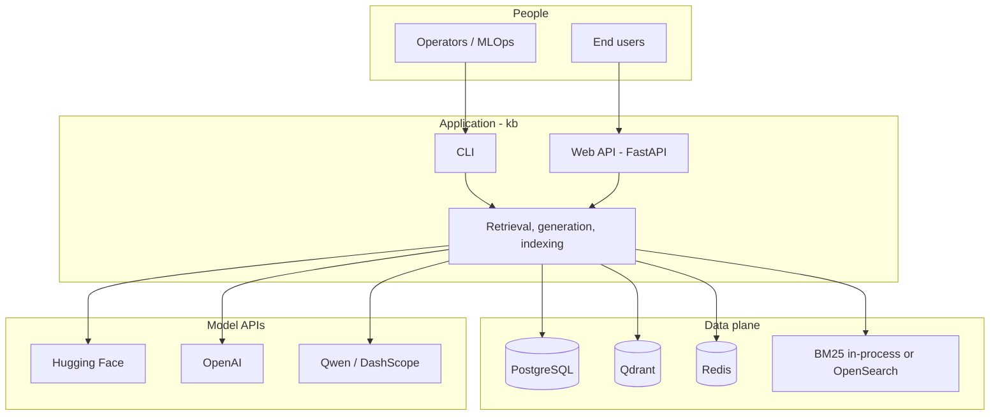
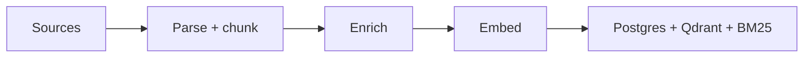
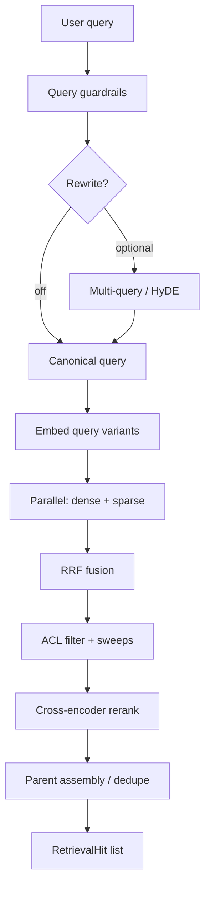
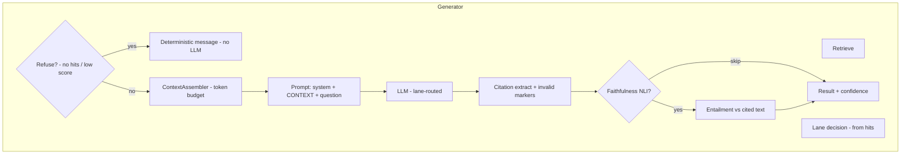
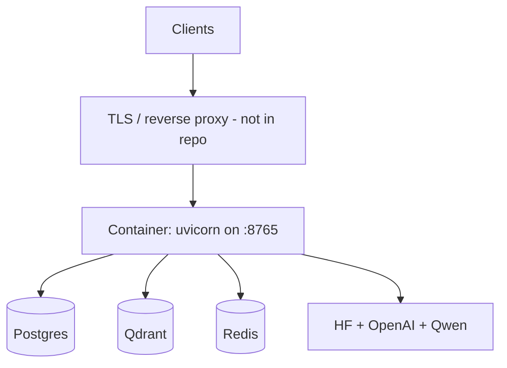

# Enterprise Knowledge-Base Search — deck outline

## Slide 1 — Title

**Enterprise knowledge-base search — grounded RAG at scale**

*Python 3.10+ · hybrid retrieval · citation-first generation · optional NLI faithfulness · FastAPI + CLI*

*Repository package: `kb` — document ingestion, Postgres + Qdrant + BM25, LLM providers via pluggable clients.*

---

## Slide 2 — Problem and product shape

| What | How this codebase addresses it |
|------|---------------------------------|
| **Relevant evidence** | Dense + sparse retrieval, RRF, cross-encoder rerank, parent–child expansion |
| **Grounded answers** | Numbered `CONTEXT` blocks, `[N]` citations, low temperature |
| **Trust signals** | Optional NLI per cited sentence, aggregate confidence, invalid citation detection |
| **Enterprise constraints** | ACL on collections, sensitivity **lanes** (no hosted/self-host mixing in one answer) |
| **Shippable surface** | `kb` CLI, FastAPI + static SPA, Docker Compose, eval harness |

**Explicit non-goals here:** enterprise SSO, billing, and production secrets management — left to platform teams.

---

## Slide 3 — System context (who talks to what)

*Redis: conversation sessions when `session_id` is used; not required for one-shot Q&A.*

---

## Slide 4 — Ingestion: staged, idempotent indexing

*Pipeline:* connector → parse → **parent/child** chunking → optional **enrichment** (summaries, synthetic questions) → **embed** → **multi-writer** index.

**Write order (failure-safe):** record decision (content hash) → **Postgres** (source of text truth) → **Qdrant** → **BM25** → mark complete. Roll back so you do not keep vectors without canonical text.

*Optional doc prep: geometric PDF margin strip before drop into corpora (see `documentation/clean_sample_docs.md`) — less boilerplate in chunks, better retrieval signal.*

---

## Slide 5 — Hybrid retrieval (the core search stack)

*Entry point: `Retriever.retrieve(query, user, config)` — every heavy stage is optional and **degrades** (e.g. rerank failure → RRF order preserved).*

*Dense: Qdrant with **collection-level** ACL pushdown. Sparse: BM25. Reranker only sees **post-ACL** candidates.*

---

## Slide 6 — Generation: RAG orchestration

*Entry points: `Generator.ask()` (full result) and `ask_stream()` (SSE / token stream + final metadata). Same stages except LLM call shape.*

*Lane policy: the strictest **sensitivity** among hits wins; if `self_hosted_only` is in the set, the **entire** answer uses the self-hosted stack — no cross-lane paraphrase leakage.*

---

## Slide 7 — Why answers stay closer to the corpus (defence in depth)

| Layer | Mechanism | Engineer takeaway |
|-------|-----------|-------------------|
| **Retrieval** | RRF + rerank + optional HyDE / multi-query | Fix recall/precision; bad retrieval is the #1 cause of “confident wrong” RAG |
| **Context** | Numbered blocks, per-hit cap, optional chunk summaries in prompt | Tight **bind** between model view and retriever order |
| **Generation** | System prompt: cite with `[N]`, refuse if context insufficient | “Extractive QA” contract; temp ~0.1 |
| **Post-gen** | Parse `[N]` → **invalid_markers** if the model invents an index | Observable hallucination of citation IDs |
| **Post-gen** | NLI: premise = cited source, hypothesis = **cited** sentence | Flags **unsupported** claims that still have markers |
| **Score** | Confidence combines **retrieval** and **faithfulness** (geometric mean) | One scalar for gating/UX; tune on golden set |

*Faithfulness is **not** a proof of user correctness; it is **entailment of the written answer against the cited passage** at a threshold.*

---

## Slide 8 — Security and conversation semantics

* **ACL** — `UserContext` maps to allowed Qdrant collections; rules duplicated for sparse path; see `kb/retrieval/acl.py`.*
* **Query guardrails** — length, injection heuristics, code-dump patterns; **before** retriever/LLM to cap abuse and cost (`kb/guardrails/`).*
* **Sessions (Redis)** — prior turns + **conversation-aware rewriter** so “it / that” follow-ups resolve to a **canonical** query for BM25 and rerank; avoids retrieval collapse on pronouns.*
* **Profiles** — `APP_PROFILE` (`demo` / `demo-isolated` / `prod`) switches provider mix and safety rails; prod refuses unsafe demo overrides at startup.*

---

## Slide 9 — Interfaces, configuration, and quality loop

| Surface | Use |
|--------|-----|
| **CLI** | `kb ingest`, `kb search`, `kb ask`, `kb health`, `kb eval`, session helpers |
| **API** | `/api/search`, `/api/ask`, `/api/ask/stream` (SSE), health, config, session create |
| **Config** | Pydantic `Settings` + per-request `RetrievalConfig` / `GenerationConfig` |

**Eval:** golden-set runner, optional RAGAS batch paths, calibration hooks — **offline**; keeps latency regressions and threshold drift from shipping unnoticed.

**Observability:** structured logging; optional **LangSmith** when keys are set.

---

## Slide 10 — Deployment and extension points (reference)

*Production hardening* (typical, not in-repo): full authN/Z, rate limits, WAF, and secrets in a vault.

**Extension points senior teams care about:** new `kb/connectors/` + `parsers/`, inject mock rerank/LLM in tests, swap `BM25_BACKEND` toward OpenSearch, alternative `QueryRewriter` / lane policies, new `StreamEvent` consumers.

**Deeper reading:** `documentation/architecture.md` (full detail), `documentation/features.md` (anti-hallucination RAG feature list), `data/infra_provisioning.md` (models and profiles).

---

*End of outline — about ten slides, diagrams included.*
